## 1.
https://github.com/masaya-o/RDD

## 2.
The author tests the effect of harsher punishments and sanctions on driving under the inluence (DUI) using administrative records on 512,964 DUI stops from the state of Washington. In this setting, punishments are determined by strict rules on blood alcohol content (BAC) and previous offenses. The author utilizes the regression discontinuity design where the cutoffs are set at 0.08 BAC (above which is considered a DUI) and 0.15 BAC (an aggravated DUI). Drivers having a BAC higher than 0.15 are subject to higher fines, increased jail times, and a longer license suspension period than those having a BAC higher than 0.08 but less than 0.15. The author confirms that there is no sign of manipulation around cutoffs and no discontinuity in control variables. The RD estimates suggest that having a BAC above the DUI threshold reduces recidivism by up to 2 percentage points (17 percent). Likewise having a BAC over the aggravated DUI threshold reduces recidivism by an additional percentage point (9 percent). These results are robust to different bandwidths and the "donut RD" specification. The results suggest that the additional sanctions experienced by drunk drivers at BAC thresholds are effective in
reducing repeat drunk driving.

## 3.
$\rightarrow$ do.file

## 4.
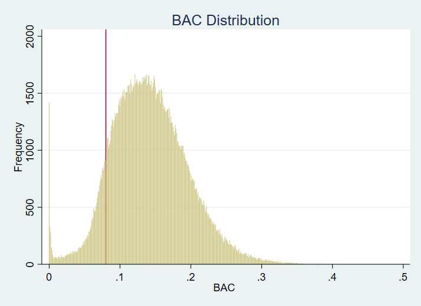

The replicated figure has the slightly smaller peak and smaller count at BAC = 0 than Hansen's. However, it doesn't show a noticeable sign of manipulation around the cutoff at BAC = 0.08. This is in line with Hansen's finding that the distribution of BAC shows little evidence of endogenous sorting to one side of the threshold.

## 5.
\begin{center}
Replicated Table 2: Regression Discontinuity Estimates for the Effect \\ of Exceeding the 0.08 BAC Threshold on Predetermined Characteristics
\end{center}
\begin{center}
\input{"table/table2.tex"}
\end{center}
Because none of the estimated coefficients on DUI is significantly different from zero, we can say that the covariates are balanced at the cutoff.

## 6.

\begin{center}
Panel A: Accident
\end{center}
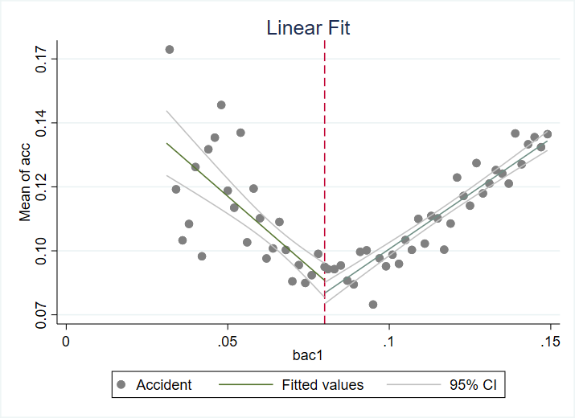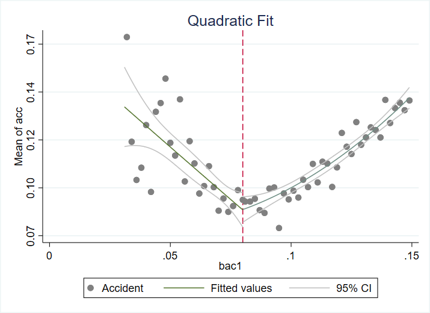

\begin{center}
Panel B: Male
\end{center}
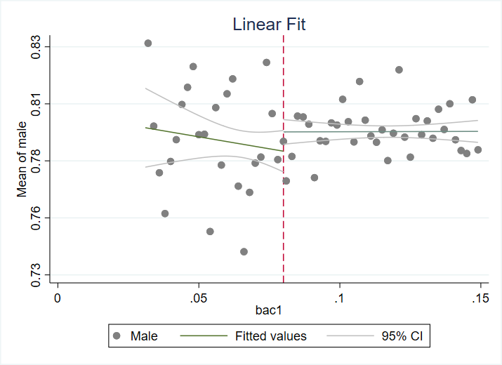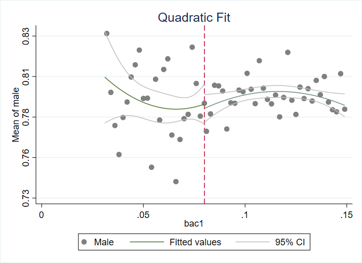

\begin{center}
Panel C: Age
\end{center}
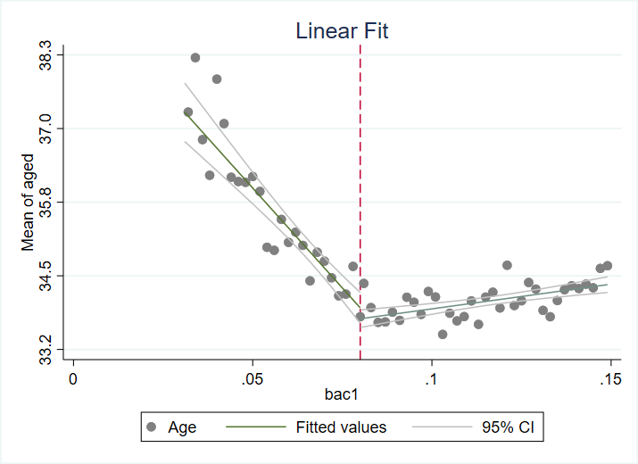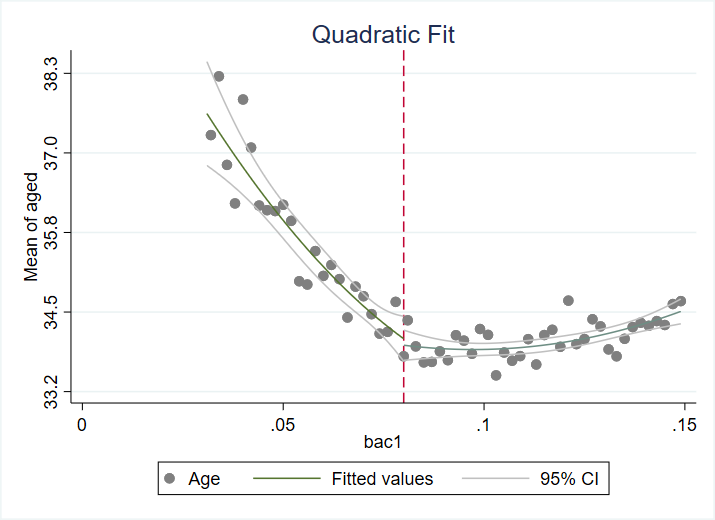

\begin{center}
Panel D: White
\end{center}
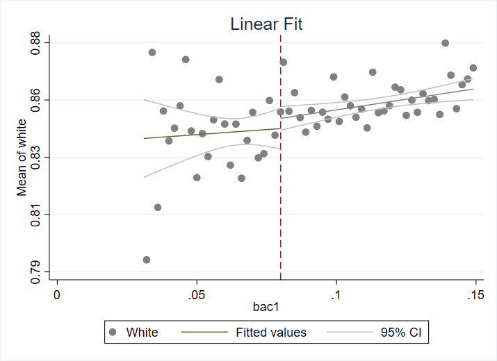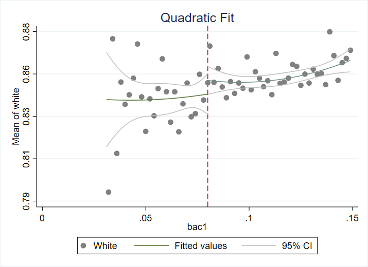

Following Hansen's paper, I divide the window into two regions based on BAC: 0.03 to 0.079 and 0.08 to 0.15, and I use the bin width of 0.02. Linear fitted values are similar to those in Hansen's paper. For each covariate 95% confidence intervals overlap at the cutoff regardless of linear or quadratic, suggesting that the covariates are balanced.

## 7.
\begin{center}
Replicated Table 3: Regression Discontinuity Estimates for the Effect \\ of Exceeding the 0.08 BAC Threshold on Recidivism
\end{center}
\begin{center}
\input{"table/table3.tex"}
\end{center}

Columns 1, 2, and 3 correspond to assignment directions 1, 2, and 3, respectively. I use robust standard errors with clustering at the BAC level.

## 8.
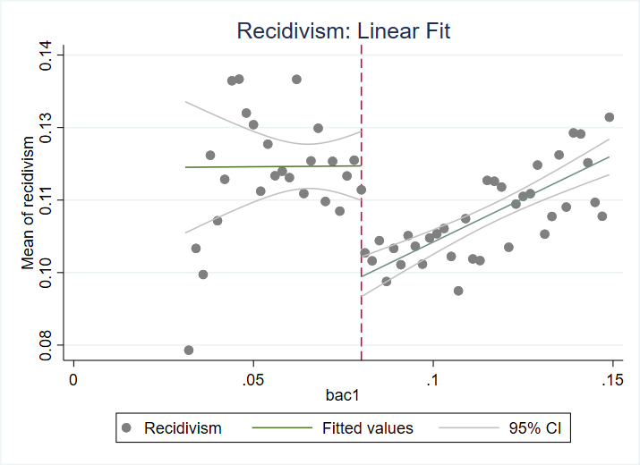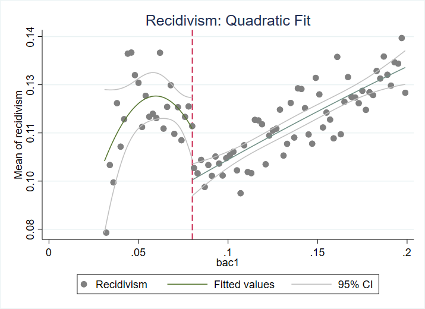

## 9.
I examined whether punishments reduce recidivism among drunk drivers. First I confirmed by using a local linear regression and graphics that the covariates are balanced at the cutoff. Then I estimated the effect of punishments on recidivism with two different bandwidths (0.05 and 0.025) and three different specifications (linear model with the same slope, linear model with different slopes, and quadratic model). The results suggest that punishments are expected to reduce recidivism by 1.4 percentage points to 2.7 percentage points depending on the regression specification, and they are all statistically significant at the 1% level. The figures in part 8 clearly show that the effects can vary with underlying model, that is, linear or quadratic (or even higher polynomials).

I'm highly confident in Hansen's original conclusion because, aside from his conclusion being quite intuitive, he conducts further auxiliary analyses, such as regressions using different kernels and the donut RD design, to support his main finding, which makes his analyses more convincing.

Also, in this exercise, I personally learned how to create a batch file to automatically run a .do and .R files. It turns out easier than I thought it would be.
